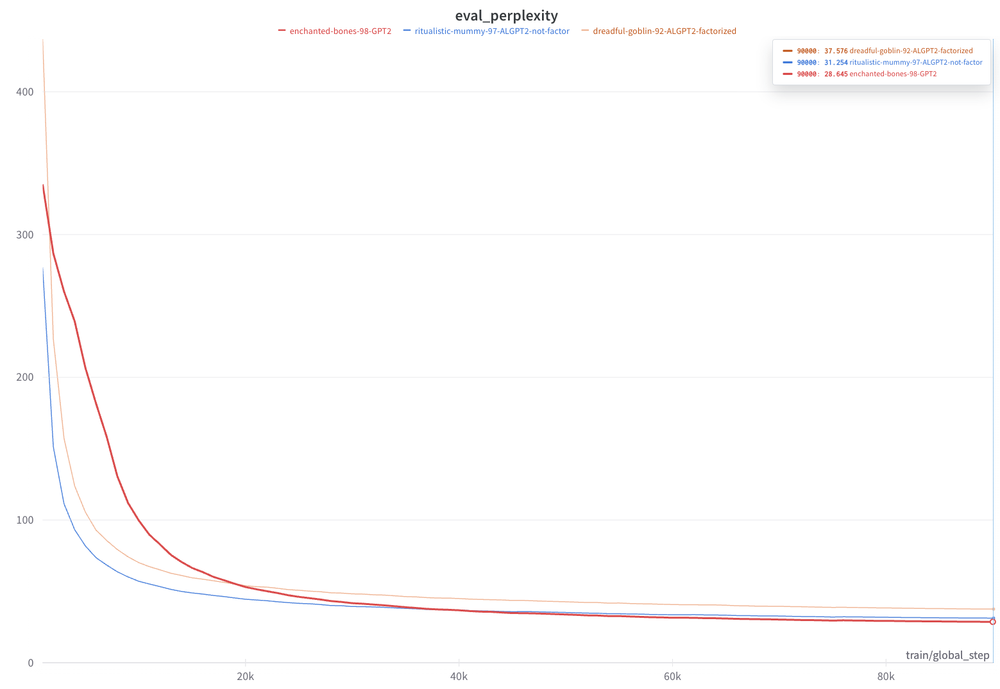

# ALGPT2
Implementarion of two ALBERT techniques on GPT2 model:
1) Embeddings matrix factorization
2) Cross layer parameters sharing

## Hugging Face Hub

- Standard GPT2 pretrained on `wikitext-103-v1`:

| Model Description                                                      | HuggingFace hub                                                                                                                     |
|------------------------------------------------------------------------|-----------------------------------------------------------------------------------------------------------------------------------------|
| ALGPT2 with embeddings factorization pretrained and parameters sharing | [Link](https://huggingface.co/tGhattas/ALGPT2LMHeadModel-default_depth-wikitext-103-v1_factorized_embeds_wandb_dreadful_goblin_92)      |
| ALGPT2 with only parameters sharing                                    | [Link](https://huggingface.co/tGhattas/ALGPT2LMHeadModel-default_depth-wikitext-103-v1_not_factorized_embeds_wandb_ritualistic-mummy-97) |
| Standard GPT2 pretraining                                                | [Link](https://huggingface.co/tGhattas/GPT2LMHeadModel-default_depth-wikitext-103-v1_not_factorized_embeds_wandb_enchanted_bones_98) |

## Technicalities
- Trained on 2 x Nvidia RTX6000 Ada 48 GB
- batch size of 60
- for 6 epochs
- tokenized the data using a BPE based tokenizer that we pretrained on the same dataset

## Runbook
Training the tokenizer on wikitext variants
```bash
python train_tokenizer.py --dataset_path [wikitext-103-v1 or wikitext-2-v1]
```

Running the pretraining
```bash
python run_model.py --model_class_name [ALGPT2LMHeadModel or  ALGPT2LMHeadModel] --batch_size 60 --num_of_epochs 6  --sequence_max_length 256 --learning_rate 0.0006 --device gpu --save_steps 2000 --dataset_path [wikitext-103-v1 or wikitext-2-v1]   --tokenizer_path [wikitext-103-v1 or wikitext-2-v1] [--factorized_embeds]

```

## Results
### Eval mean perplexities

### For the full report in WANDB click [here](https://api.wandb.ai/links/tghattas-team/qd1vaj5y)
